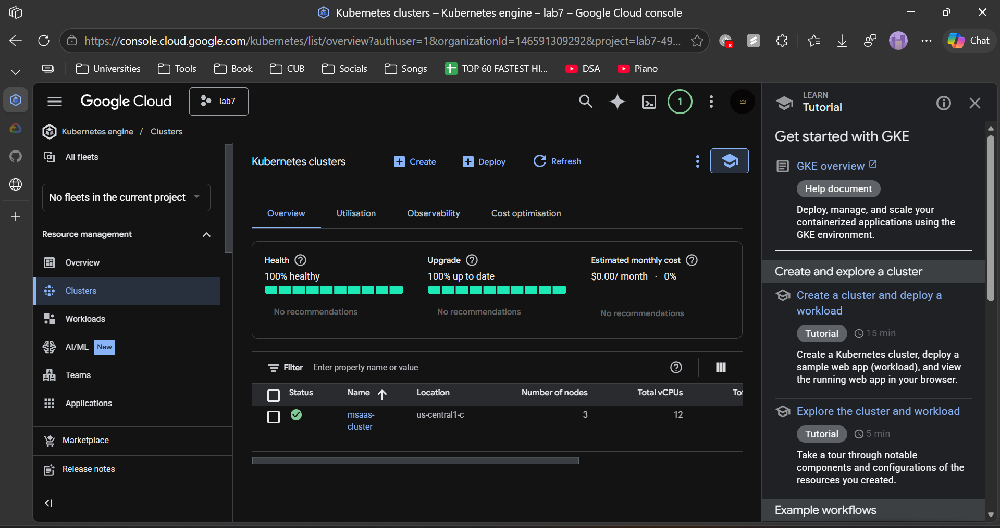
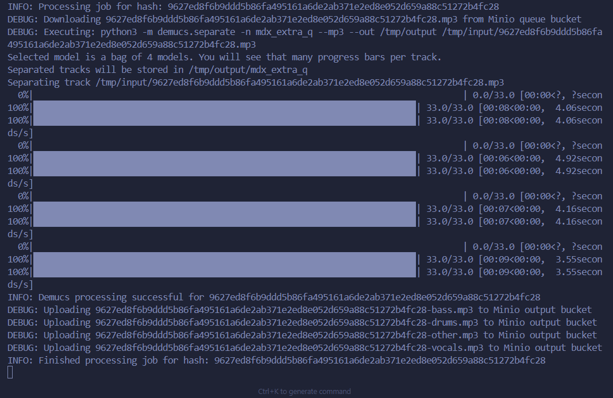
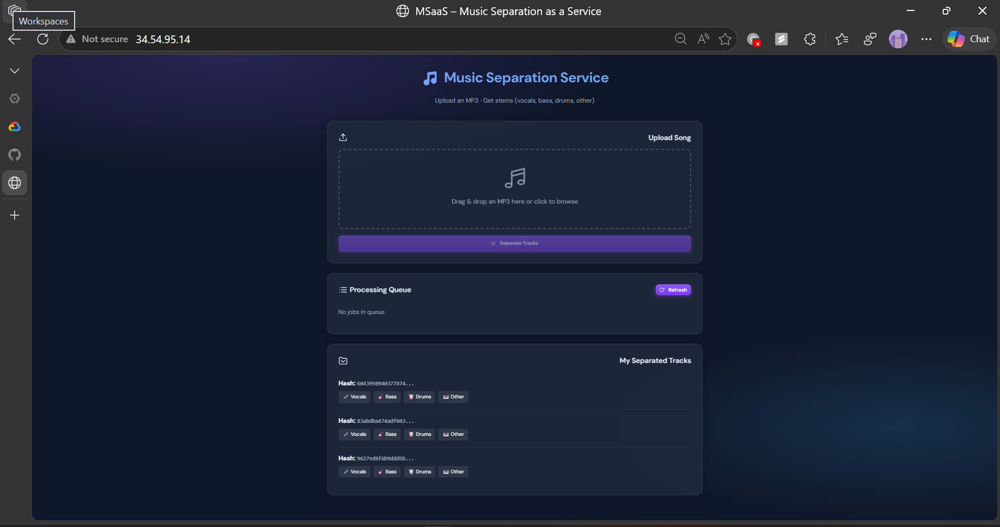

## Lab 7 – Demucs on GKE: Solution Approach

This write-up explains how I wired up the **Demucs music separation service** on GKE, how I debugged the deployment, and what I observed from end to end. I’m writing it from my point of view, describing what I ran and what I saw.

---

## What I Had to Build

The goal for this lab was to run **Music Separation as a Service (MSaaS)** on Google Kubernetes Engine:

- A **REST service** that accepts an MP3, queues work, and serves the UI.
- A **worker** that pulls jobs from Redis, runs **Demucs** to split the track into stems (vocals, bass, drums, other), and uploads results to MinIO.
- Supporting services: **Redis** (queue + logging), **MinIO** (object storage), and a **logs** deployment that tails Redis logging.
- The whole thing had to run on a GKE cluster, using Docker images in **gcr.io** and Kubernetes **Deployments / Services / Ingress**.

---

## Docker Images and Kubernetes Manifests

### REST image

I started from the provided `rest/Dockerfile-rest` and built the REST image:

```bash
docker build --no-cache -f rest/Dockerfile-rest -t gcr.io/<PROJECT_ID>/demucs-rest:v1 rest/
docker push gcr.io/<PROJECT_ID>/demucs-rest:v1
```

This image:

- Uses `python:3.9-slim`.
- Installs `redis`, `flask`, `minio`, and `jsonpickle`.
- Copies `rest-server.py` and `index.html` into `/app` and runs the Flask app on port 5000.

On the Kubernetes side, I used `rest-app.yaml` to define:

- A `Deployment` named `rest-deployment`, with:
  - Image `gcr.io/<PROJECT_ID>/demucs-rest:v1`.
  - Env vars:
    - `REDIS_HOST=redis`
    - `MINIO_HOST=minio:9000`
  - Container port 5000.
- A `Service` (`rest-service`) of type `NodePort` on port 5000.
- An `Ingress` (`rest-ingress`) pointing external traffic to `rest-service`.

### Worker image

The worker image is based off `xserrat/facebook-demucs:latest`:

```bash
docker build --no-cache -f worker/Dockerfile-worker -t gcr.io/<PROJECT_ID>/demucs-worker:v1 worker/
docker push gcr.io/<PROJECT_ID>/demucs-worker:v1
```

The Dockerfile:

- Starts from `xserrat/facebook-demucs:latest`.
- Installs `minio`, `redis`, and `requests`.
- Sets `WORKDIR /app` and copies `worker-server.py`.
- Runs `python3 worker-server.py` as the container command.

The `worker-app.yaml` defines:

- `worker-deployment` with one replica.
- Container image `gcr.io/<PROJECT_ID>/demucs-worker:v1`.
- `imagePullPolicy: Always`.
- `command: ["python3", "worker-server.py"]` to make sure my script is the main process.
- Env vars:
  - `REDIS_HOST=redis`
  - `MINIO_HOST=minio:9000`

### Supporting services: Redis, MinIO, logs

I applied the stock Redis and logs manifests:

```bash
kubectl apply -f redis/redis-deployment.yaml
kubectl apply -f redis/redis-service.yaml
kubectl apply -f logs/logs-deployment.yaml
```

For MinIO, the repo originally had an `ExternalName` service pointing at a MinIO namespace that didn’t exist in my cluster. I simplified this by deploying MinIO directly into the `default` namespace:

- `minio-deployment.yaml`:
  - `Deployment` named `minio` running `minio/minio:latest`.
  - `MINIO_ROOT_USER=rootuser`, `MINIO_ROOT_PASSWORD=rootpass123`.
  - Container port 9000.
  - Mode `server /data`.
- `Service` named `minio` (ClusterIP, port 9000), so the URI `minio:9000` works from rest and worker.

I deleted the old `ExternalName` service and applied my own:

```bash
kubectl delete -f minio/minio-external-service.yaml
kubectl apply -f minio/minio-deployment.yaml
```

At this point `kubectl get pods` showed all five components up, and in the Google Cloud Console I could see the Kubernetes cluster and workloads running:



---

## REST Service: Environment and MinIO/Redis Setup

In `rest-server.py` I made the REST app more robust to how Kubernetes injects environment variables, especially around Redis and MinIO.

### Redis: handling Kubernetes `REDIS_PORT`

Kubernetes automatically injects a `REDIS_PORT` env var like `tcp://34.54.95.14:6379` when there is a `Service` named `redis`. The original code tried to do:

```python
REDIS_PORT = int(os.environ.get('REDIS_PORT', 6379))
```

When the pod started, this crashed with:

```text
ValueError: invalid literal for int() with base 10: 'tcp://34.118.239.26:6379'
```

I fixed this by adding a helper that understands both the “tcp://” format and plain ports, and also supports a custom `REDIS_DB_PORT` if needed:

```python
def _redis_host_port():
    port_raw = os.environ.get('REDIS_DB_PORT') or os.environ.get('REDIS_PORT', '6379')
    if isinstance(port_raw, str) and '://' in port_raw:
        from urllib.parse import urlparse
        u = urlparse(port_raw)
        host = u.hostname or os.environ.get('REDIS_HOST', 'redis')
        port = u.port or 6379
        return host, port
    try:
        port = int(port_raw)
    except (ValueError, TypeError):
        port = 6379
    return os.environ.get('REDIS_HOST', 'redis'), port

REDIS_HOST, REDIS_PORT = _redis_host_port()
redisClient = redis.StrictRedis(host=REDIS_HOST, port=REDIS_PORT, db=0)
```

### MinIO: consistent host and port

Originally `MINIO_HOST` was set to `"minio-proj"` without a port and pointed to a namespace that did not exist. That caused `NameResolutionError` in the REST logs when checking buckets.

I aligned everything so:

- Kubernetes sets `MINIO_HOST=minio:9000`.
- The code ensures there’s always a port:

```python
_minio_host = os.environ.get('MINIO_HOST', 'minio:9000')
MINIO_HOST = _minio_host if ':' in _minio_host else f'{_minio_host}:9000'
```

Then I initialize the MinIO client with `MINIO_HOST`, credentials, and `secure=False`. On startup I also ensure the `queue` and `output` buckets exist:

```python
def ensure_buckets():
    try:
        if not minioClient.bucket_exists("queue"):
            minioClient.make_bucket("queue")
        if not minioClient.bucket_exists("output"):
            minioClient.make_bucket("output")
    except S3Error as err:
        print(f"Error checking/creating buckets: {err}")
```

---

## Worker: Job Loop, Demucs, and Logging

The worker process is responsible for:

1. Blocking on a Redis list (`toWorker`) for new jobs.
2. Downloading the MP3 for the given hash from the MinIO `queue` bucket.
3. Running **Demucs** to separate the track.
4. Uploading the resulting stems to the MinIO `output` bucket.
5. Triggering a callback (if provided) and cleaning up local files.

### Job structure and Redis BLPOP

When the REST service enqueues a job it pushes a JSON object onto the Redis list `toWorker`:

```json
{
  "hash": "<songhash>",
  "callback": { ... }
}
```

In `worker-server.py` I consume this queue via `BLPOP`:

```python
redisClient = redis.StrictRedis(
    host=REDIS_HOST,
    port=REDIS_PORT,
    db=0,
    socket_connect_timeout=10,
    socket_timeout=None,
    decode_responses=False,
)

def run_worker_loop():
    print("Worker loop started, blocking on Redis BLPOP...", flush=True)
    while True:
        try:
            work = redisClient.blpop("toWorker", timeout=0)

            if not work:
                continue

            queue_name, job_data_bytes = work
            job_data = json.loads(job_data_bytes.decode('utf-8'))
            ...
        except Exception as e:
            log_info(f"Exception in worker main loop: {str(e)}")
            time.sleep(5)
```

I wrapped this in a top-level `while True` with a try/except so that if the loop ever exits unexpectedly, the worker logs the error to stderr and retries rather than silently exiting with code 0 and going into CrashLoopBackOff.

### Demucs execution and MinIO uploads

For each job, the worker:

1. Builds `/tmp/input/<hash>.mp3` and `/tmp/output`.
2. Downloads the MP3 from MinIO:

   ```python
   minioClient.fget_object("queue", f"{songhash}.mp3", local_mp3_path)
   ```

3. Runs Demucs using `os.system`:

   ```python
   demucs_cmd = f"python3 -m demucs.separate -n mdx_extra_q --mp3 --out {output_dir} {local_mp3_path}"
   log_debug(f"Executing: {demucs_cmd}")
   exit_code = os.system(demucs_cmd)
   ```

4. If `exit_code == 0`, it walks the Demucs output directory:

   ```python
   tracks_dir = os.path.join(output_dir, "mdx_extra_q", songhash)
   tracks = ["bass.mp3", "drums.mp3", "other.mp3", "vocals.mp3"]
   for track in tracks:
       track_path = os.path.join(tracks_dir, track)
       if os.path.exists(track_path):
           minio_object_name = f"{songhash}-{track}"
           minioClient.fput_object("output", minio_object_name, track_path, content_type="audio/mpeg")
   ```

5. Finally, it triggers the callback (if present) and cleans up local files.

Here is an example of what I saw in the command-line logs when a job was being processed by the worker and Demucs:



After Demucs finishes, the worker logs uploads each stem and returns to “blocking on Redis BLPOP”.

---

## REST API and Web UI

### `/apiv1/separate`

The REST endpoint accepts a JSON body with a base64-encoded MP3 and an optional callback:

```json
{
  "mp3": "<base64 mp3>",
  "callback": {}
}
```

The server:

1. Decodes the base64 MP3.
2. Computes a SHA-256 hash of the bytes as a unique `songhash`.
3. Stores `<songhash>.mp3` into the MinIO `queue` bucket.
4. Pushes a job onto the Redis `toWorker` list.
5. Returns the hash in the response.

### `/apiv1/queue`

This endpoint returns the jobs still in the Redis list `toWorker`. Because the worker uses `BLPOP`, jobs disappear from this list as soon as the worker picks them up. To make the UI more informative, I:

- Use `/apiv1/queue` for **waiting** jobs.
- Track recently submitted hashes in `localStorage` and show them as **Processing** for a configurable time window, even after they’ve been popped from Redis.

### `/apiv1/track/<hash>/<track_name>`

Once Demucs has produced and uploaded stems, I can retrieve them from MinIO using:

```text
/apiv1/track/<songhash>/vocals.mp3
/apiv1/track/<songhash>/bass.mp3
/apiv1/track/<songhash>/drums.mp3
/apiv1/track/<songhash>/other.mp3
```

The handler streams the MinIO object as `audio/mpeg` so the browser can download it directly.

### UI improvements

I also spent some time updating `index.html` to make the UI look more polished and informative without changing the backend:

- Switched to **DM Sans** and a dark gradient background.
- Added cards for:
  - “Upload Song”
  - “Processing Queue”
  - “My Separated Tracks”
- Added inline SVG icons and emojis for a more modern feel.
- In the “My Separated Tracks” section, each stem turns into a labeled link:
  - 🎤 Vocals
  - 🎸 Bass
  - 🥁 Drums
  - 🎹 Other
- Implemented local tracking of hashes so the UI remembers which songs I’ve submitted and can show their download links later.

Here is what the final UI looked like:



---

## Debugging and Fixes

This lab required a fair amount of debugging to get all moving parts working together. Here are the key issues I ran into and how I fixed them.

### 1. Redis `REDIS_PORT` injected as `tcp://...`

**Symptom:** REST pods crashed on startup with:

```text
ValueError: invalid literal for int() with base 10: 'tcp://34.118.239.26:6379'
```

**Cause:** Kubernetes injects `REDIS_PORT=tcp://34.54.95.14:6379` when a `Service` named `redis` exists. The code tried to cast that string directly to an int.

**Fix:** Implemented `_redis_host_port()` that:

- Checks for `://` and, if present, parses it with `urlparse`.
- Otherwise, tries to parse the value as an integer port.
- Falls back to `6379` on errors.

After rebuilding the REST image and rolling the deployment, the crash went away.

### 2. MinIO service not reachable (`minio-proj` / port 80)

**Symptom:** In the REST logs I saw:

```text
HTTPConnectionPool(host='minio-proj', port=80): Max retries exceeded ...
Name or service not known
```

**Cause:**

- The app was using `MINIO_HOST=minio-proj` (no port).
- The original MinIO `Service` was an `ExternalName` pointing to a namespace that didn’t exist in my cluster.

**Fix:**

- Deployed MinIO directly into the `default` namespace with a proper `Service` named `minio` on port 9000.
- Updated `rest-app.yaml` and `worker-app.yaml` to set `MINIO_HOST=minio:9000`.
- Added a small helper in both rest and worker to append `:9000` if someone sets only the hostname.

After this, both REST and worker successfully connected to MinIO and could create buckets and objects.

### 3. Worker pod repeatedly showing Completed / CrashLoopBackOff

**Symptom:** The worker pod was cycling between `Running`, `Completed`, and `CrashLoopBackOff`, with no useful logs.

**Causes and fixes:**

1. **Buffered output / missing logs**  
   I made logging unbuffered and explicit:

   - Set `PYTHONUNBUFFERED=1` in the Dockerfile.
   - Called `sys.stdout.reconfigure(line_buffering=True)` when available.
   - Printed a startup line: `Worker process starting...`.

   This made it obvious that the process was actually starting and, later, where it stopped.

2. **Entrypoint / command**  
   To avoid any surprises from the base image’s entrypoint, I:

   - Explicitly set `CMD ["python3", "worker-server.py"]` in the Dockerfile.
   - Reinforced this in Kubernetes with `command: ["python3", "worker-server.py"]`.

3. **Logic bug in the worker loop**  
   At one point, `queue_name, job_data_bytes = work` was incorrectly indented inside the `if not work: continue` block, so it never ran when there *was* work. On top of that, `job_data_bytes` could be undefined when the code tried to decode it, leading to an exception.

   I fixed the indentation and added a broader `run_worker_loop()` wrapper to log and recover from unexpected exceptions instead of exiting silently.

Once these were fixed, the worker pod stayed in `Running` and processed jobs correctly.

### 4. Multiple rest pods, one in CrashLoopBackOff

After several rollouts I often saw:

```text
rest-deployment-<old>   0/1 CrashLoopBackOff ...
rest-deployment-<new>   1/1 Running ...
```

This is normal for a rolling update: Kubernetes creates a new ReplicaSet and then terminates the old pods. To clean up the visual noise I deleted the old pod manually:

```bash
kubectl delete pod rest-deployment-<old>
```

The `rest-deployment` controller kept the new, healthy pod.

---

## End-to-End Run and Observations

Once everything was wired up and stable, I did a full end-to-end test:

1. **Uploaded an MP3 via the UI.**
   - The file was base64-encoded in the browser and sent to `/apiv1/separate`.
   - The server responded with a `hash` and showed a status message “✓ Song enqueued! Hash: …”.

2. **Observed the queue and worker.**
   - The “Processing Queue” card updated to show the new hash as “Processing”.
   - The worker logs showed:
     - Receiving the job.
     - Downloading the MP3 from MinIO.
     - Running Demucs (`mdx_extra_q`, bag of 4 models) with progress bars over ~5 minutes for a ~5‑minute track.

3. **Verified outputs in MinIO and via the UI.**
   - After Demucs finished, the worker uploaded four stems to the `output` bucket and logged success.
   - In the UI, the “My Separated Tracks” card showed my hash and four download links:
     - 🎤 Vocals
     - 🎸 Bass
     - 🥁 Drums
     - 🎹 Other
   - Clicking each link downloaded the correct stem as an MP3.

4. **Captured screenshots for the report.**
   - Command-line view of the worker logs while processing one of the audio tracks.
   - Google Cloud Console view of the Kubernetes cluster.
   - Screenshot of the final UI.

---

## Tear-Down to Avoid Charges

After I confirmed everything worked and took the screenshots I needed, I tore the environment down so I wouldn’t continue to get billed:

- Deleted the Kubernetes workloads and services for this lab:

  ```bash
  kubectl delete ingress rest-ingress --ignore-not-found
  kubectl delete deployment rest-deployment worker-deployment logs redis --ignore-not-found
  kubectl delete service rest-service redis minio --ignore-not-found
  ```

- Optionally, I can delete the GKE cluster and the GCP project itself (`lab7-490321`) to ensure no lingering resources remain.

---

## Summary

In this lab I:

- Containerized a REST API and a Demucs worker, published them to **Google Container Registry**, and deployed them to **GKE**.
- Wired the services together using **Redis** (job queue + logging), **MinIO** (object storage), and a small **logs** deployment.
- Fixed several real‑world issues around Kubernetes‑injected environment variables, missing MinIO backend, worker lifecycle, and logging.
- Built a small but clean web UI that lets me submit an MP3, watch the job’s status, and download the separated stems.

The final system successfully takes an MP3 upload, runs Demucs in the worker pod, and exposes the separated tracks via the REST service and the UI, with everything running on Kubernetes.

